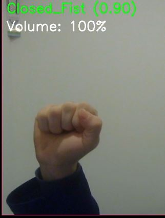
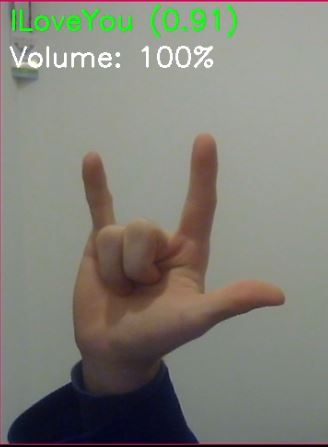
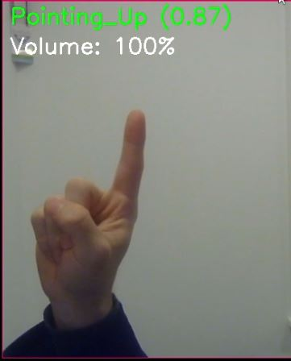
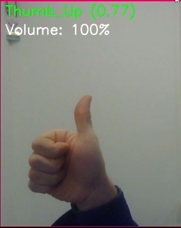
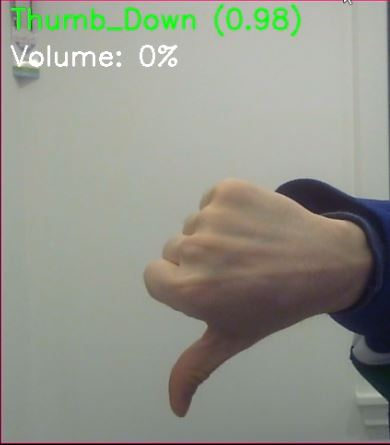

# Gesture Controlled Media

## Goal

Build something with a camera.

## Result

"Gesture Media Control" is a Python script that enables control of your computers media via easy to remember hand gestures.

The hand gestures enable you to volume up/down, skip, go back, pause, max volume.

## Requirements (versions I am using)

- Webcam/PiCamera
- Python (3.8 - 3.12.6)
- opencv-python (4.8.1.78)
- mediapipe (0.10.21)
- pycaw (20251023, for Windows)
- pulsectl (24.12.0, for Linux systems using PulseAudio)
- pynput (1.8.1)
- gesture_recognizer.task ([Download Here](https://storage.googleapis.com/mediapipe-models/gesture_recognizer/gesture_recognizer/float16/1/gesture_recognizer.task)).

### gesture_recognizer.task

This is a pre-trained model that recognizes hand gestures from the camera frames captured by OpenCV. Download it and place it next to main.py.

## Actions
### 1. ***Closed_Fist***: Play/Pause Audio

### 2. ***ILoveYou***: Max Volume

### 3. ***Pointing_Up***: Next Song

### 4. ***Victory***: Replay/Previous Song

### 5. ***Thumb Up***: Volume Up

### 6. ***Thumb Down***: Volume Down

